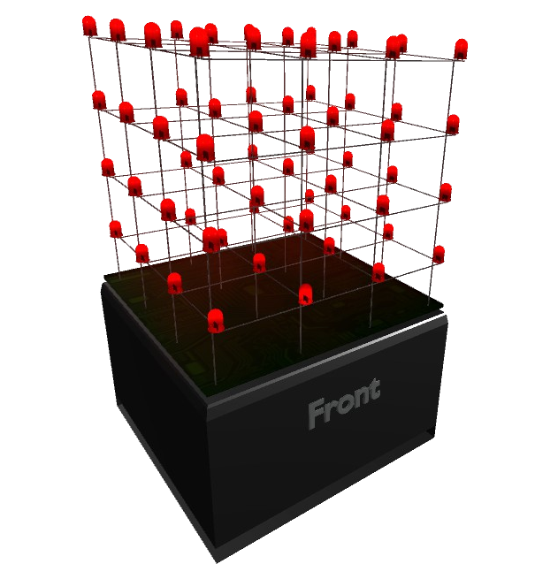

# Cube 3D 

[

##### Table of Contents  
* [Introduction](#Introduction)
* [Installing](#Installing)  
* [Contributing](#Contributing)  
* [Authors](#Authors)
* [License](#License)  

## Introduction
<a name="Introduction"/>

This is an application for generating code for a LED cube. The application is capable of simulating the LED cube as well as generate the necessary code for programming the LED cube in either [Arduino](https://www.arduino.cc/en/Main/Software) or C with [Atmel Studio](https://www.microchip.com/mplab/avr-support/atmel-studio-7). Currently, this works for a 4x4x4 LED cube and will eventually include other sizes. The Arduino/Atmega328 code and details can be found in the [LED-Cube-Code](https://github.com/mariugul/LED-Cube-Code) repository.

## Getting Started
<a name="GettingStarted"/>

Watch the YouTube tutorials: (coming soon)
* [Intro]()
* [Basics]()
* [Coding]()
* [Code Generator]()
* [Advanced]()

## Installing
<a name="Installing"/>

Download the application (.exe) from [releases](https://github.com/mariugul/cube-3d/releases) and follow the install wizard. It works for Windows 10 and possibly earlier Windows OS'es (not tested).

## Usage
The application generates a pattern table for a 4x4x4 LED cube and makes it easy to visualize the patterns. The code for programming the LED cube comes with the application and does also exist in its own repository [LED-Cube-Code](https://github.com/mariugul/LED-Cube-Code). The application is depicted in the image below.

 

## Examples
"Describe how to make a simple starter program"

## Future Improvements

<a name="HelpContributing"/>

## Help and Contributing

Check out the [Discord](https://discord.com/invite/ZgxjkC2) server if you need help with the code not working or if you have suggestions for improvement! The [YouTube]() channel has video tutorials to help out as well. (YouTube videos coming soon)

<a name="License"/>

## License
This project is licensed under the MIT license and is open source. You are free to use this project as you wish as long as you credit the work. See the [LICENSE](LICENSE) file for details. I would highly appreciate if you contributed to the project that you share it so this can be a big open source project!

<a name="Authors"/>

## Authors
 [Marius C. K. Gulbrandsen](https://www.linkedin.com/in/marius-c-k-gulbrandsen-963a69130/) 
