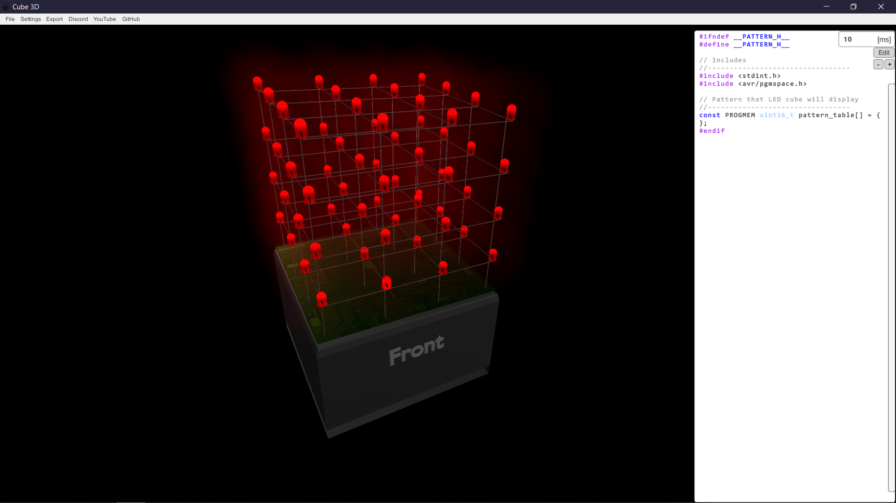
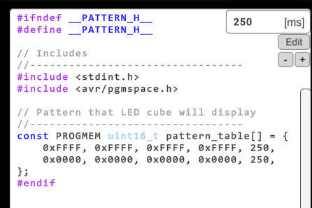
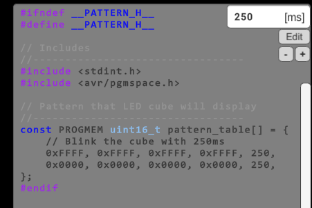
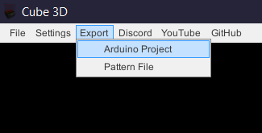
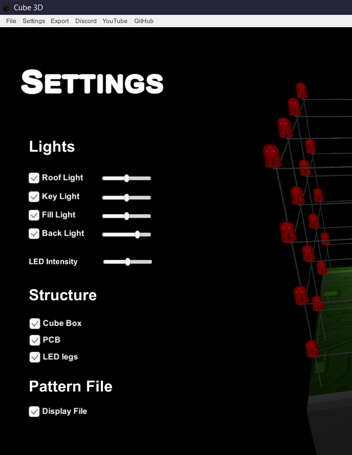
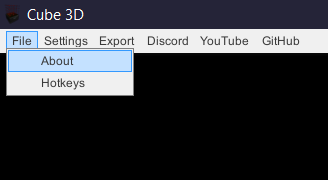

# Cube 3D 

This is an application for generating code for a LED cube. It generates the necessary code for programming the LED cube with either [Arduino](https://www.arduino.cc/en/Main/Software) or C, using [Atmel Studio](https://www.microchip.com/mplab/avr-support/atmel-studio-7). Currently, this works for a 4x4x4 LED cube and will eventually include other sizes. The Arduino/Atmega328 code and details can be found in the [LED-Cube-Code](https://github.com/mariugul/LED-Cube-Code) repository. The application will be simulating the LED cube as well in the future. 

## Table of Contents  
* [Installing](#Installing)  
* [Usage](#Usage)
* [YouTube Tutorials](#YouTubeTutorials)
* [Future Improvements](#FutureImprovements)
* [Help and Contributing](#HelpContributing)  
* [License](#License)  
* [Authors](#Authors)
* [Acknowledgement](#Acknowledgement)

<a name="Installing"/>

## Installing
Download the latest application (.exe) from [releases](https://github.com/mariugul/cube-3d/releases) and follow the install wizard. It works for Windows 10 and possibly earlier Windows OS'es (not tested).

<a name="Usage"/>

## Usage
The application generates a pattern table for a 4x4x4 LED cube and makes it easy to visualize the patterns. The code for programming the LED cube comes with the application and also exist in its own repository [LED-Cube-Code](https://github.com/mariugul/LED-Cube-Code).

<a name="CodeEditor"/>

### Code Editor
Possibly the most important part of the application is the code editor. This enables editing of what's going to become the pattern.h file, which contains all patterns for the LED cube. The code editor responds to `Enter` for generating patterns. It will then generate a pattern line depending on which LEDs are lit on the cube. By pressing `Delete` you simply delete the latest line. It has an input field for the time variable, by changing this you change how long (in ms) a pattern will be displayed on the cube. There are also two buttons for increasing and decreasing the code size and editor, these are the `+` and `-` buttons.

 

By default the code in the editor is not editable. By clicking the `Edit` button you can edit the code. The thought is that you can add comments to structure the code and change it if something went wrong. Just a FYI, don't edit the code outside of the array as that might break the functionality of the hotkeys and make the exported files be exported wrongly. When you are in _edit_ mode, `Enter` will not work to generate code. When edit mode is enabled the code editor goes gray as shown in the image.

 

<a name="Export"/>

### Export
When you are happy with the code generated in the code editor, you can export it. There are two options, exporting as Arduino project or exporting just the pattern file. Exporting the Arduino project gives you a folder with the Arduino code for the LED cube and the `pattern.h` file, while exporting the pattern file simply gives `pattern.h`. Whatever is in the code editor is going to be in `pattern.h`. Remember to always write a filename or foldername for export to work. The exporter will always ask you where to export the code.

 

<a name="Settings"/>

### Settings
This is the panel where you can customize the cube. The environment the cube is in has four lights in the traditional [Three-point lighting](https://en.wikipedia.org/wiki/Three-point_lighting?oldformat=true) plus a roof light. Adjust these lights if you feel the need to do so. The intensity of the LEDs can also be adjusted.

The cube consists of a box, PCB, LED legs and LEDs. You can switch off the cube box, PCB and LED legs for a cleaner look. This is of course up to your preferences. The code editor can also be turned off if you wish to just inspect the cube or for the future release with simulation.

 

<a name="File"/>

### File
This button contains the _About_ information and the _Hotkeys_ information. Seeing what hotkeys exists and how to use them is very useful for an efficient workflow. In the future this will probably include _Save Project_ and similar as well.

 

### Zoom and Rotate
To zoom in on the cube simply use the scroll wheel or touchpad to zoom. To rotate the cube right click and drag the cube around. Whenever you right click you will reset the camera. This is both great if you want to go back to the default camera position and annoying if you dont. This is a known limitation that will be solved in a future update. The 3D model of the cube is wired exactly as a real life one would be, so if you want to visualize the wiring you can zoom in on the connections.

<a name="YouTubeTutorials"/>

## YouTube Tutorials
Watch the YouTube tutorials: (coming soon)
* [1. LED Cube Intro]()
* [2. LED Cube Theory]()
* [3. LED Cube Wiring]()
* [4. LED CUBE Coding]()
* [5. LED Cube App]()

<a name="FutureImprovements"/>

## Future Improvements
Some of the things on the list for future improvements and features are:
* Simulate the cube. This is halfway implemented already and will probably come in a new release.
* Display the wiring of the cube (planes/columns/LED numbering).
* Change cube color with color picker.
* Improve the zooming functionality.
* Functionality for saving projects and keeping patterns saved in the application.
* Adding example patterns to the application.

<a name="HelpContributing"/>

## Help and Contributing

Check out the [Discord](https://discord.com/invite/ZgxjkC2) server if you need help with the code not working or if you have suggestions for improvement! The [YouTube]() channel has video tutorials to help out as well. (YouTube videos coming soon)

<a name="License"/>

## License
This project is licensed under the MIT license and is open source. You are free to use this project as you wish as long as you credit the work. See the [LICENSE](LICENSE) file for details. I would highly appreciate if you contributed to the project that you share it so this can be a big open source project!

<a name="Authors"/>

## Authors
 [Marius C. K. Gulbrandsen](https://www.linkedin.com/in/marius-c-k-gulbrandsen-963a69130/) 

<a name="Acknowledgement"/>

## Acknowledgement
Big thanks to my brother [Stig Thomas Gulbrandsen](https://github.com/ribbreaker) for helping with Unity and C# issues, it has been much appreciated. 
Also, thank you to [Denis](https://github.com/Meragon) who created a [Unity-WinForms](https://github.com/Meragon/Unity-WinForms) wrapper. He has been immensely helpful with getting WinForms to work.
